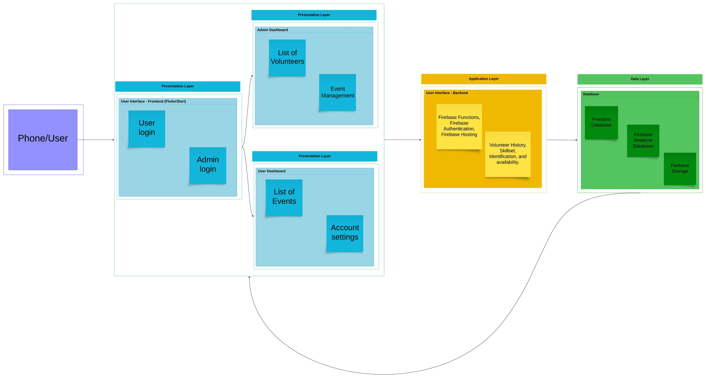

# Initial Thoughts (2 points)
Discuss your initial thoughts in detail on how you will design this application.

As a team, we decided to follow the infamous terminology for KISS (Keep It Simple Stupid). There are a lot of ways to overengineer this project, but we’re going to keep it simple. We’ll be building a single mobile application with two different flows in it: Administrator / Volunteer. Based on the user type of the user logging in, he would be taken to the appropriate flows within the application, and have appropriate access. We will be using the Flutter framework to build the mobile application. 

For the backend, we’re going to be using Firebase. 
Firebase Authentication for the user registrations and login
Firestore to store all the data i.e. users, volunteers, events, etc. 
Firebase Functions to manipulate the data before storing it

For the designs, we’ll be starting off with rough handmade sketches, then take them into Figma, and eventually program it into the mobile application.

### Technology stack: Flutter, Dart, Firebase, Figma
		
# Development Methodology (2 points)
Discuss which development methodology you will use and why.
Since this project’s requirements are well-defined, and are unlikely to change, we decided to go with the Waterfall development methodology. Considering our small team of 4 people, the Waterfall development methodology would ensure smooth progress.

# High-Level Design / Architecture (6 points)
Provide a high-level design or architecture of the solution you are proposing.

| Group Member Name       | What is your contribution?        | Discussion Notes                                                                 |
|-------------------------|-----------------------------------|----------------------------------------------------------------------------------|
| Rasheed Omar            | Diagram Design, Development Decisions. | Assisted in planning and designing the diagram, assisted in planning out the frameworks and programming structure. |
| Muhammad Ammar          | Diagram Design, Development Decisions. | Assisted in planning and designing the diagram, assisted in planning out the frameworks and programming structure. |
| Zainulabdeen Aldawah    | Diagram Design, Development Decisions. | Assisted in planning and designing the diagram, assisted in planning out the frameworks and programming structure. |
| Salim Sanogho           | Diagram Design, Development Decisions. | Assisted in planning and designing the diagram, assisted in planning out the frameworks and programming structure. |
